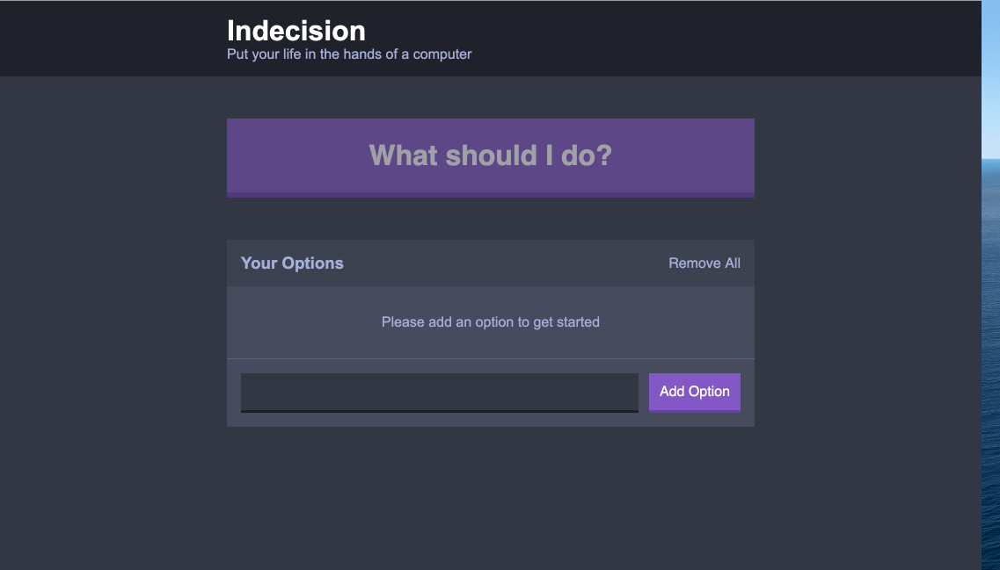
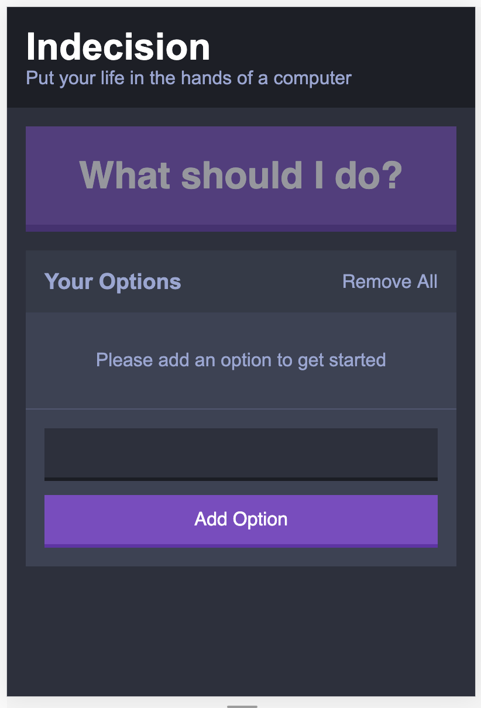

# Web_dev_react

These are web apps I developed using React frame work. And it is mainly refering to the Udemy Course [The Complete React Web Developer Course (with Redux)](https://www.udemy.com/course/the-complete-react-js-redux-course-build-modern-web-apps/?utm_source=adwords&utm_medium=udemyads&utm_campaign=React_v.PROF_la.EN_cc.US_ti.7450&utm_content=deal4584&utm_term=_._ag_79286080766_._ad_436603255117_._kw__._de_c_._dm__._pl__._ti_dsa-774930031089_._li_9005779_._pd__._&matchtype=b&gclid=EAIaIQobChMI06a-yZj46QIVmYrICh1bbwPAEAAYASAAEgLEO_D_BwE)

## Indecision-app

This is an app for task management. Users can add tasks they want to do and remove tasks if they have finished that. If the client don't which task to do, they can also click "what should I do?" button to randomly chose one thing to do. And this is also responsive. So when you are on labtop or desktop device, it looks like:



On mobile device, it will become:



### Contents
* [Setup](#Setup)
* [Run the application on localhost server](#Run-the-application-on-localhost-server)

### Setup

I develope this app using yarn as backend. And all depencies and scrips needed to run app are in package.json file. So you can simplely git clone this repository and then run the script below.

```
yarn install
```
All dependencies needed for this app will be installed.

### Run the application on localhost server

It is very easy to run this app since I didn't use the real database or user authentication login/register for this app. So no need to start docker. So far, the data storage for this app still use local_storage. Run following script to run this app.

```
yarn run dev_server
```

This is also convenient if you want to make development on this code. Running this code is equivalent to run babel, live-server, and all loaders for this app. 


